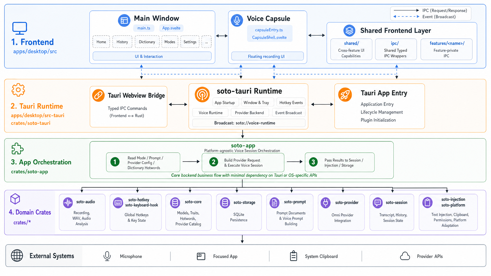

<div align="center">


# Soto

**AI-powered voice input for your desktop** — press a hotkey, speak, and the transcript lands wherever your cursor is.

[Releases](https://github.com/cauyxy/sotoapp/releases) · [Contributing](CONTRIBUTING.md)

[](LICENSE)
[](https://github.com/cauyxy/sotoapp/releases)
[](https://tauri.app)
[](https://www.rust-lang.org)
[](https://svelte.dev)
[](https://ko-fi.com/cauyxy)

</div>

---

Soto is a cross-platform desktop voice-input app: hold a hotkey, speak, release, and your transcript is injected into whatever app holds focus. It is inspired by [type4me](https://github.com/joewongjc/type4me) by [@joewongjc](https://github.com/joewongjc) — bringing the same hotkey-driven flow to **macOS and Windows** via Tauri 2 + Rust. Compared with type4me, Soto replaces the original ASR2LM pipeline with an **Omni-model architecture** where the provider consumes audio and prompt context in a single multimodal request.

The whole UX is anchored on a tiny floating **voice capsule** that confirms the mic is hot, visualises your speech in real time, and gets out of the way the moment the transcript is delivered:

<div align="center">


</div>

## Architecture

<div align="center">



</div>

The project is a **Cargo workspace + pnpm monorepo**. The frontend is a Svelte 5 (runes mode) app rendered by Tauri's webview; the runtime business logic lives in small focused crates wired together through `soto-app`; Tauri commands and OS hooks live in `soto-tauri`.

```
crates/
  soto-audio           microphone capture and WAV writing
  soto-core            prompt builder, hot-word collection
  soto-hotkey          hold/toggle session reducer
  soto-injection       text injection ladder (native → clipboard → paste)
  soto-keyboard-hook   OS keyboard hook (WH_KEYBOARD_LL / CGEventTap)
  soto-platform        platform adapters (Windows SendInput, clipboard)
  soto-providers       Omni provider client (Mimo + Doubao Ark)
  soto-session         session completion, history writing
  soto-storage         SQLite-backed settings, modes, history, dictionary
  soto-tauri           Tauri commands, runtime wiring

apps/desktop/
  src/app/             shell chrome (Sidebar, WindowControls, CapsuleShell)
  src/features/        per-page modules (home, history, modes, dictionary, settings)
  src/shared/          cross-feature UI primitives and stores
  src/ipc/             Tauri command wrappers shared across features
```

Frontend layering rules and crate boundaries are spelled out in [CONTRIBUTING.md](CONTRIBUTING.md) and [AGENTS.md](AGENTS.md).

## Quick Start

The fastest way is to grab a pre-built installer from the [Releases](https://github.com/cauyxy/sotoapp/releases) page:

| Platform | Installer |
|----------|-----------|
| macOS (Apple Silicon) | `Soto_*_aarch64.dmg` |
| Windows 11 (x64) | `Soto_*_x64-setup.exe` |

1. Install and launch Soto.
2. Open **Settings → Engine** and configure an Omni provider (Mimo or Doubao Ark).
3. Hold the configured hotkey, speak, release — the transcript is injected at your cursor.

> **macOS only — two permissions in System Settings → Privacy & Security:**
> - **Microphone** — capture audio while the hotkey is held
> - **Accessibility** — inject the final transcript and listen for the global hotkey across apps
>
> You can review and request access anytime in **Settings → Permissions** inside Soto; that panel keeps status checks read-only and uses macOS' native authorization prompts for Microphone and Accessibility. Microphone distinguishes `Not requested` from `Denied`: `Not requested` triggers the system authorization prompt, while denied or restricted access opens the matching OS pane so you can toggle it back on.

If you'd rather build from source, see [Development](#development) below.

## Features

### Capture

- **Hotkey-triggered recording** — hold or tap a configurable key combo to start and stop
- **Voice capsule** — a tiny floating window confirms you're being heard and lets you abort

### Transcription

- **Omni-model providers** — Mimo, Doubao Ark, and Qianwen (DashScope) out of the box; one request carries audio + prompt + hot-words. Recommended models: `qwen3.5-omni-plus` (Qianwen) and `doubao-seed-2-0-lite-260428` (Doubao Ark)
- **Modes** — per-mode system prompts (Default, Translate, and your own) tailor the model's output
- **Dictionary / hot words** — boost recognition for domain-specific terms

### Output

- **Universal text injection** — inserts into any app via the native input ladder (SendInput / CGEvent), with clipboard paste as a fallback
- **History** — searchable local session log with privacy controls
- **Single binary per platform** — no background services, no installers stacking up

## Development

**Prerequisites:** Rust 1.90+, Node.js, pnpm 10.24+

```bash
# Install JS dependencies
pnpm install

# Type-check Svelte templates
pnpm --filter @soto/desktop check

# Run all tests
pnpm test
cargo test --workspace

# Dev server (hot-reload UI + Tauri backend)
pnpm tauri dev

# Release build
pnpm tauri build
```

For macOS permission testing, use one canonical TCC identity instead of mixing
`pnpm tauri dev`, temporary bundle paths, and older app names:

```bash
# Build the Developer ID signed app and install it as /Applications/Soto.app
pnpm app:install-canonical

# Clear Soto's canonical Microphone + Accessibility TCC records before retesting
pnpm app:reset-tcc

# Launch this path manually when testing permissions
open /Applications/Soto.app
```

`pnpm app:install-canonical` verifies that the installed app uses
`org.sotoapp.sotoapp`, a Developer ID Application signature, and the
`com.apple.security.device.audio-input` entitlement required for macOS
microphone prompts under Hardened Runtime. Permission checks should not use
`pnpm tauri dev`, `target/release/bundle/macos/Soto.app`, or the legacy
`SotoMac` name.

On a locked-down Windows shell, enable pnpm via Corepack first:

```powershell
corepack enable pnpm --install-directory "$env:APPDATA\npm"
```

### Build outputs

| Platform | Path |
|----------|------|
| macOS | `target/release/bundle/dmg/Soto_*_aarch64.dmg` |
| Windows | `target/release/bundle/nsis/Soto_*_x64-setup.exe` |

## Roadmap

### Context enrichment

Soto currently builds prompts from the mode system prompt and dictionary hot-words. Future work will feed richer signals to the AI so it can produce better transcriptions and transformations with less manual configuration.

| Signal | Approach | Status |
|--------|----------|--------|
| **Focused window** — app name + window title | Query the OS window manager at session start and append to the prompt (e.g. "User is writing in Slack → #engineering-channel") | Planned |
| **Window content** — visible text in the active app | macOS Accessibility API (`AXUIElement`) / Windows UI Automation; screen-reader–style extraction at record time | Planned |
| **Clipboard** — text already copied by the user | Read clipboard at record start and include as a hint; powers natural "rewrite this" / "translate this" flows without a custom mode | Planned |

### Streaming partial transcript

Show a live preview of the transcription inside the recording capsule as audio is processed, rather than waiting until the session ends. Reduces the "did it hear me?" uncertainty and lets the user abort early if recognition goes off-track. Requires provider-side streaming support (Mimo / Doubao Ark SSE).

### Dictionary AutoLearn

Words that appear in a completed transcript but were not in the user's dictionary could be automatically surfaced as candidates to add. A post-session review UI (or a confidence-threshold auto-add) would let the dictionary grow organically from real usage without manual curation.

### Detailed hot-word management

Make hot words easier to tune once the dictionary grows beyond a flat enabled/disabled list. Candidate improvements include per-mode hot-word sets, priority or weight controls, alias/pronunciation hints, bulk import/export, and review tools for stale or conflicting entries.

## Contributing

See [CONTRIBUTING.md](CONTRIBUTING.md) for layering rules and test expectations.

## Support

If Soto has been useful to you, you're welcome to buy a coffee on [Ko-fi](https://ko-fi.com/cauyxy). It helps cover code-signing certificates and the R2 bandwidth behind the auto-updater — much appreciated either way.

## Acknowledgments

- **Inspiration**: [type4me](https://github.com/joewongjc/type4me) by [@joewongjc](https://github.com/joewongjc) — the original macOS voice-input app written in SwiftUI. We owe the core product design to type4me: hotkey-driven sessions, mode-based prompts, dictionary / hot words, and local history. If you're on macOS only, please also check out the upstream project.
- **Runtime**: [Tauri](https://tauri.app), [Svelte](https://svelte.dev), [Rust](https://www.rust-lang.org)
- **Providers**: [Mimo](https://mimo.cn), [Doubao Ark](https://www.volcengine.com/product/ark), [Qianwen / DashScope](https://dashscope.aliyun.com)

## License

MIT — see [LICENSE](LICENSE).
