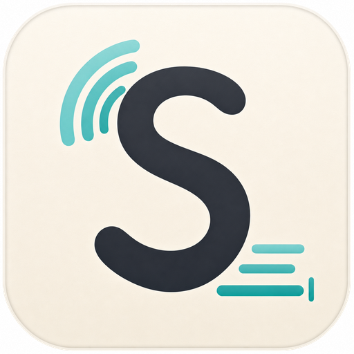
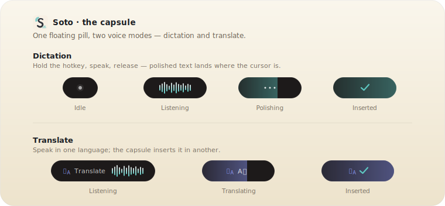
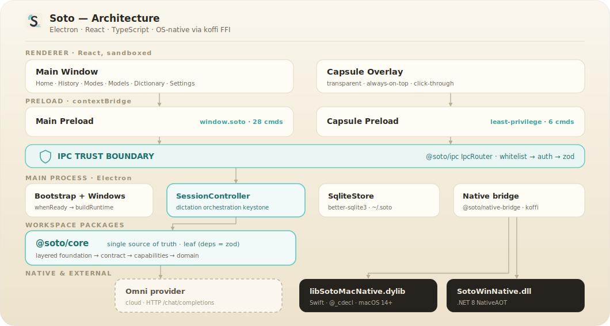

<div align="center">



# Soto

**AI-powered voice input for your desktop** — press a hotkey, speak, and the transcript lands wherever your cursor is.

### [⬇ Download for macOS &amp; Windows — sotoapp.org](https://sotoapp.org)

[Website](https://sotoapp.org) · [Releases](https://github.com/cauyxy/sotoapp/releases) · [Contributing](CONTRIBUTING.md)

[](https://sotoapp.org)
[](LICENSE)
[](https://sotoapp.org)
[](https://www.electronjs.org)
[](https://react.dev)
[](https://www.typescriptlang.org)
[](https://ko-fi.com/cauyxy)

</div>

---

Soto is a cross-platform desktop voice-input app: hold a hotkey, speak, release, and your transcript is injected into whatever app holds focus. It is inspired by [type4me](https://github.com/joewongjc/type4me) by [@joewongjc](https://github.com/joewongjc) — bringing the same hotkey-driven flow to **macOS and Windows**. Compared with type4me, Soto replaces the original ASR2LM pipeline with an **Omni-model architecture** where the provider consumes audio and prompt context in a single multimodal request.

The whole UX is anchored on a tiny floating **voice capsule** that confirms the mic is hot, visualises your speech in real time, and gets out of the way the moment the transcript is delivered. It has two modes — **dictation** and **translate**:

<div align="center">



</div>

## Quick Start

Download the latest installer from **[sotoapp.org](https://sotoapp.org)** (or the [GitHub Releases](https://github.com/cauyxy/sotoapp/releases) page):

| Platform | Installer |
|----------|-----------|
| macOS (Apple Silicon) | `Soto_*_aarch64.dmg` |
| Windows 11 (x64) | `Soto_*_x64-setup.exe` |

1. Install and launch Soto.
2. Open the **Models** page and configure an Omni provider (e.g. MiMo, Doubao, or Qwen).
3. Hold the configured hotkey, speak, release — the transcript is injected at your cursor.

> **macOS only — two permissions in System Settings → Privacy &amp; Security:**
> - **Microphone** — capture audio while the hotkey is held
> - **Accessibility** — inject the final transcript and listen for the global hotkey across apps
>
> You can review and request access anytime in **Settings → Permissions** inside Soto; that panel keeps status checks read-only and uses macOS' native authorization prompts for Microphone and Accessibility.

If you'd rather build from source, see [Development](#development) below.

## Features

### Capture

- **Hotkey-triggered recording** — hold or tap a configurable key combo to start and stop
- **Voice capsule** — a tiny floating window confirms you're being heard and lets you abort

### Transcription

- **Omni-model providers** — MiMo, Doubao, and Qwen out of the box, plus any OpenAI-compatible endpoint; one request carries audio + prompt + hot-words
- **Modes** — per-mode system prompts (Dictation, Translate, and your own) tailor the model's output
- **Dictionary / hot words** — boost recognition for domain-specific terms

### Output

- **Universal text injection** — inserts into any app through the platform injection ladder: Windows native insertion uses SendInput, while macOS uses clipboard paste with Cmd+V dispatch through the native bridge
- **History** — searchable local session log with privacy controls
- **Self-contained desktop package** — no background services; the native macOS dylib or Windows DLL is bundled with the app

## Architecture

<div align="center">



</div>

Soto is an **Electron + React + TypeScript** desktop app in a **pnpm workspace monorepo**. All the business logic lives in a pure-TypeScript core package; the Electron main process is a thin orchestration + persistence + native-bridge layer; the renderer is React; and OS-native capabilities are reached through [koffi](https://koffi.dev) FFI into per-platform native libraries. There is **no Rust** — `@soto/core` is the single source of truth for types and logic.

```
packages/
  core (@soto/core)           pure TS logic + canonical zod types: chord matching,
                              session FSM, audio DSP/WAV, omni provider client,
                              prompt assembly, hot-word ranking, IPC schemas.
                              Layered foundation/contract/capabilities/domain
                              (dependency-cruiser-enforced). Zero Electron/native
                              deps; fully unit-tested.
  ipc (@soto/ipc)             the IPC trust boundary: per-command router + the
                              command policy catalog. Builds on @soto/core.
  native-bridge (@soto/native-bridge)   the koffi FFI seam: native ABI decls +
                              bridge loader + the InjectionNativePort contract.

apps/desktop (@soto/desktop)   the Electron app (electron-vite + React)
  src/main/                   main process: the IPC router (trust boundary) from
                              @soto/ipc, Drizzle/better-sqlite3 SqliteStore
                              (~/.soto), the SessionController, and the
                              @soto/native-bridge koffi bridge.
  src/preload/                per-command contextBridge surface (no generic invoke).
  src/renderer/               React UI (pages + Zustand) + the transparent capsule.

native/
  macos/                      SwiftPM package → libSotoMacNative.dylib
                              (`@_cdecl` shim, called via koffi).
  windows/                    .NET Native AOT project → SotoWinNative.dll
                              (`UnmanagedCallersOnly` exports, called via koffi).

```

Frontend layering rules and module boundaries are spelled out in [CONTRIBUTING.md](CONTRIBUTING.md).

## Development

**Prerequisites:** pnpm 10.24.0. The workspace pins Node.js 24.16.0
through pnpm (`devEngines.runtime` in `package.json` plus the lockfile runtime);
run JS commands through `pnpm` so scripts use the managed runtime.

Platform-native dependencies (only needed when (re)building the native libraries):

- macOS development and release builds require macOS 14+ on Apple Silicon and Xcode 16+ / Swift 6+ to build `libSotoMacNative.dylib`.
- Windows development and release builds require Windows 11 x64 and the .NET 8 SDK with Native AOT support to build `SotoWinNative.dll`.

Native package details live in [native/macos/README.md](native/macos/README.md)
and [native/windows/README.md](native/windows/README.md).

```bash
# Install JS dependencies (pnpm workspace)
pnpm install

# Type-check the Electron app (main + renderer)
pnpm check

# Run all tests (@soto/core + @soto/ipc + the Electron app)
pnpm test

# Dev server (electron-vite hot-reload main + renderer)
pnpm dev

# Production build (electron-vite build)
pnpm build

# Local macOS package smoke (Swift dylib + Electron Builder + package checks)
pnpm smoke:package:mac
```

Native modules (`better-sqlite3`, koffi) are rebuilt against the bundled Electron
ABI by the app's `dev`/`package` scripts (`electron-rebuild`); `pnpm test` rebuilds
them against the pnpm-managed Node 24 ABI first. `better-sqlite3` is versioned
through the workspace catalog and remains the only approved install-time native
build in `pnpm-workspace.yaml`.

The local package smoke creates `apps/desktop/dist/Soto-<version>-arm64.dmg` and
verifies the staged `Soto.app`, codesign status, and bundled native dylib. It is
faster than the signed release gate and does not notarize.

macOS release builds that need Developer ID signing and notarization use
`pnpm build:mac:signed` with maintainer signing credentials (kept outside the
repo); it builds the Swift dylib, packages it into `Contents/Resources/native/`,
and runs Electron Builder signing/notarization. That path also emits Electron
Builder feed artifacts such as `latest-mac.yml`, and the packaging scripts verify
those files exist. The release scripts live directly under `scripts/`.

On a locked-down Windows shell, enable pnpm via Corepack first:

```powershell
corepack enable pnpm --install-directory "$env:APPDATA\npm"
```

## Roadmap

### Context enrichment

Soto currently builds prompts from the mode system prompt and dictionary hot-words. Future work will feed richer signals to the AI so it can produce better transcriptions and transformations with less manual configuration.

| Signal | Approach | Status |
|--------|----------|--------|
| **Focused window** — app name + window title | Query the OS window manager at session start and append to the prompt (e.g. "User is writing in Slack → #engineering-channel") | Planned |
| **Window content** — visible text in the active app | macOS Accessibility API (`AXUIElement`) / Windows UI Automation; screen-reader–style extraction at record time | Planned |
| **Clipboard** — text already copied by the user | Read clipboard at record start and include as a hint; powers natural "rewrite this" / "translate this" flows without a custom mode | Planned |

### Streaming partial transcript

Show a live preview of the transcription inside the recording capsule as audio is processed, rather than waiting until the session ends. Reduces the "did it hear me?" uncertainty and lets the user abort early if recognition goes off-track. Requires provider-side streaming support.

### Dictionary AutoLearn

Words that appear in a completed transcript but were not in the user's dictionary could be automatically surfaced as candidates to add. A post-session review UI (or a confidence-threshold auto-add) would let the dictionary grow organically from real usage without manual curation.

### Detailed hot-word management

Make hot words easier to tune once the dictionary grows beyond a flat enabled/disabled list. Candidate improvements include per-mode hot-word sets, priority or weight controls, alias/pronunciation hints, bulk import/export, and review tools for stale or conflicting entries.

## Contributing

See [CONTRIBUTING.md](CONTRIBUTING.md) for layering rules and test expectations.

## Support

If Soto has been useful to you, you're welcome to buy a coffee on [Ko-fi](https://ko-fi.com/cauyxy). It helps cover code-signing certificates and release distribution costs — much appreciated either way.

## Acknowledgments

- **Inspiration**: [type4me](https://github.com/joewongjc/type4me) by [@joewongjc](https://github.com/joewongjc) — the original macOS voice-input app written in SwiftUI. We owe the core product design to type4me: hotkey-driven sessions, mode-based prompts, dictionary / hot words, and local history. If you're on macOS only, please also check out the upstream project.
- **Runtime**: [Electron](https://www.electronjs.org), [React](https://react.dev), [koffi](https://koffi.dev)
- **Providers**: MiMo (Xiaomi), [Doubao](https://www.volcengine.com/product/ark) (ByteDance), [Qwen](https://www.aliyun.com/product/bailian) (Alibaba Cloud), and any OpenAI-compatible endpoint

## License

MIT — see [LICENSE](LICENSE).
